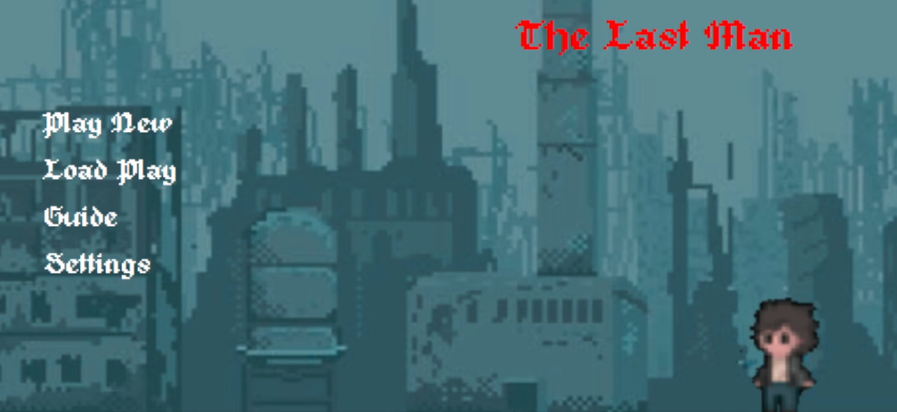

<h1 align="center" id="title">2D Pixel Shooter Game In C# Winform With Database </h1>


	
<h2>🎮 About Project</h2>
<p align="center">
	
	<p>Besides using Winforms to create business or statistical applications, we can also create a game with it. This is a project for entertainment as well as to help me better understand C# Winform.</p>
 	<p>All assets used in this project do not belong to me but it's free so feel free to use this project even commercially. I would really appreciate it if you credited me 😃 .</p>
</p>

<h2>🚀 Demo</h2>
<p align = "middle"> 
  
  
</p>
<p align ="middle">
  
</p>
<h2>💻 Built with</h2>
<h3>Programming Language</h3>
<p align ="middle">
	
</p>

<h3>Tools</h3>
<p align = "middle">
  
  
</p>

<h2>👀 Installation</h2>
<h3>Step 1: Clone this repo</h3></h3>

```bash
https://github.com/VaderNgo/2D-Pixel-Shooter-Game-In-C-Sharp-Winform-With-SQL-Database.git
```
<h3>Step 2: Install SQL Server Management Studio(SSMS)</h3>

[Here](https://www.nobledesktop.com/how-to-install-sql-server-management-studio) is how to install it

**NOTE: You need to install this tool or something else to be able to execute the SQL file**

<h3>Step 3: Excute SQL file to create game database </h3>

Excute this [SQL File](https://github.com/VaderNgo/2D-Pixel-Shooter-Game-In-C-Sharp-Winform-With-SQL-Database/blob/master/SQL%20File/GameDatabase.sql)

<h3>Step 3.1 (In case the SQLClient error): Add System.Data.SqlClient 4.8.5 Nugget </h3>

Open Solution -> Tools -> NuGet Package Managger -> Manage Nuget Packages for Solution -> Find System.Data.SqlClient 4.8.5 and install it.

<h3>Step 4: Start Game and Enjoy It</h3>

<h2>❔How to play</h2>

<h3>Keyboard</h3>
<ul>
	<li>Use arrow key to control player.</li>
	<li>"A" to attack (close range or long range depend on your current weapon).</li>
	<li>"U" to open Weapon Upgrade Window.</li>
	<li>"I" to open Inventory Window.</li>
	<li>"S" to open Shop Window.</li>
</ul>
<h3>Game Mode</h3>
<ul>
	<li>Easy</li>
	<li>Medium</li>
	<li>Hard</li>
</ul>
<h3>Enemy</h3>
<ul>
	<li>Zombie - Close range attack, no special ability.</li>
	<li>Wizard Skeleton - Long range attack, can keep its distance to attack the player</li>
</ul>
<h3>Load Play</h3>
<p>If you lose but you want to play again that game to finish it. Go to LoadPlay in main menu, connect your database , find your gameplay you want, select it and play again.</p>

<h2>License</h2>

Distributed under the MIT License. See `LICENSE.txt` for more information.
